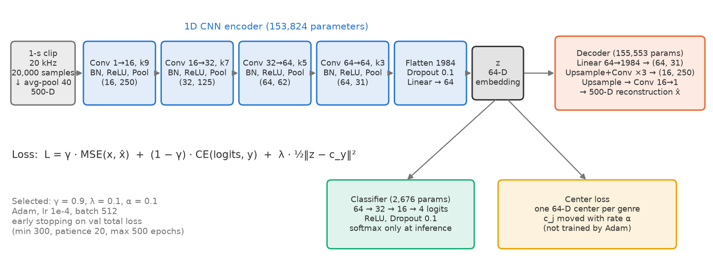
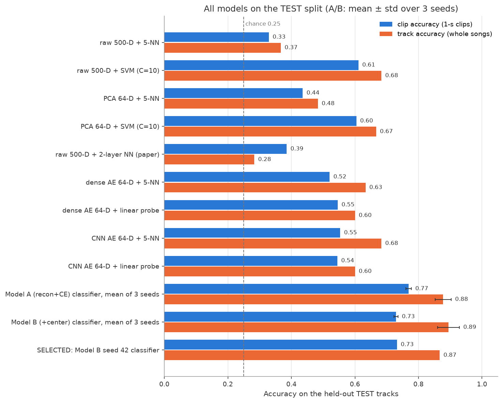

# Latent Feature Extraction for Musical Genres from Raw Audio Using a CNN-Based Autoencoder

UE24CS352A Machine Learning — mini-project.
Team: _<name 1>_, _<name 2>_ &nbsp;·&nbsp; Repository: <https://github.com/abhi1207-chugh/genre-latent-features>

A 1D CNN autoencoder learns a **64-dimensional genre embedding directly from raw audio**
(no MFCCs, no spectrograms). The embedding feeds three objectives at once —
reconstruction of the input, genre classification, and center loss — following and
extending *"Latent Feature Extraction for Musical Genres from Raw Audio"* (Sawhney,
Vasavada, Wang; `docs/paper.pdf`).

**Research question.** Can a CNN autoencoder trained on raw audio learn a compact 64-D
representation that captures genre, and does adding center loss improve that space?

**Short answer (on our data).** Yes to the first: supervised CNN embeddings reach 0.77 5-NN
accuracy on held-out tracks vs 0.33 for raw audio and 0.55 for an unsupervised CNN
autoencoder. **No** to the second: center loss made the genre metrics *worse* (≈ −4 points)
and only improved reconstruction.

---

## 1. Data
- **GTZAN** (Kaggle), 4 genres: Classical, Country, Disco, Hip-Hop — 100 tracks each, ~30 s, 22,050 Hz.
- **Track-level split before clipping**, stratified by genre (seed 42): 280 / 60 / 60 tracks
  (70 / 15 / 15 per genre). All clips of a song stay in one split → no song appears in both
  training and test. (The original paper split at clip level.)
- Each track → resampled to 20 kHz → full 1-second clips → average pooling by 40 → **500 values per clip**
  → standardized with one mean / std fitted on training clips only.
- 11,992 clips: 8,396 train / 1,799 validation / 1,797 test.

## 2. Model


- **Encoder:** 4 × [Conv1d → BatchNorm → ReLU → MaxPool 2] (16/32/64/64 channels, kernels 9/7/5/3),
  (1, 500) → (64, 31) → Flatten → Dropout 0.1 → Linear → **z ∈ ℝ⁶⁴**.
- **Decoder:** mirror with upsampling → 500-D reconstruction.
- **Classifier:** 64 → 32 → 16 → 4 logits (softmax only at inference).
- **Center loss:** one 64-D center per genre, moved towards the genre's embeddings with rate α.
- **Loss:** `L = γ·MSE(x, x̂) + (1 − γ)·CE(logits, y) + λ·½‖z − c_y‖²`
  — γ: reconstruction / classification trade-off, λ: center-loss weight, α: center learning rate.
- Training: PyTorch, Adam, lr 1e-4, batch 512, seed 42; early stopping on validation total loss
  with min 300 / patience 20 / max 500 epochs (in several configurations the reconstruction term
  only starts improving after ~120–170 epochs; stopping earlier leaves a decoder that outputs zeros).

## 3. Results (held-out TEST tracks)
| Model | Clip accuracy | Track accuracy |
|---|---|---|
| Raw 500-D + 5-NN | 0.329 | 0.367 |
| Raw 500-D + RBF-SVM (C = 10, best baseline) | 0.611 | 0.683 |
| PCA 64-D + RBF-SVM | 0.604 | 0.667 |
| Paper's 2-layer NN on raw 500-D | 0.385 | 0.283 |
| Dense AE 64-D + 5-NN (unsupervised) | 0.520 | 0.633 |
| CNN AE 64-D + 5-NN (unsupervised) | 0.554 | 0.683 |
| **Model A**: recon + CE (γ 0.9, λ 0) — 3 seeds | **0.769 ± 0.009** | 0.878 ± 0.026 |
| **Model B**: + center loss (γ 0.9, λ 0.1, α 0.1) — 3 seeds | 0.730 ± 0.006 | **0.894 ± 0.035** |
| **Selected model** (Model B, seed 42) | 0.732 | 0.867 (52 / 60) |

Track accuracy = average the clip probabilities of a song, then take the most likely genre.



- **Model selection** (validation only): 9 runs, γ ∈ {0.5, 0.9, 0.99} × λ ∈ {0.001, 0.01, 0.1}, α = 0.1.
  Rule: valid if val reconstruction ≤ 1.5 × plain-CNN-AE error (0.802); highest val 5-NN accuracy on the
  frozen embeddings; within 1 point → lower reconstruction. Selected: γ 0.9, λ 0.1 (`results/figures/pareto_grid_val.png`).
- **γ trade-off:** γ = 0.99 reconstructs best but has the weakest embeddings; γ = 0.5 never learns to
  reconstruct (stays at the "output zeros" error); γ = 0.9 balances both.
- **Center-loss ablation** (3 seeds, same everything else): on validation *and* test, Model A beats Model B
  on clip accuracy, 5-NN and linear probe **for every seed** (≈ 4–5 points); silhouette is unchanged;
  center loss mainly shrinks all embeddings (‖z‖ 21 → 1) and improves reconstruction. The small
  track-level advantage of B (+1.7 points) is within seed variation. **We do not claim center loss helps.**
- **Errors:** Classical is easy (92 % of clips, 15 / 15 tracks); the main confusion is Disco ↔ Hip-Hop.

All tables and figures: [`results/README.md`](results/README.md).

## 4. Setup
Tested on macOS (Apple M1, 8 GB) with Python 3.13; uses the Apple GPU (MPS) when available,
else CUDA, else CPU.
```bash
git clone https://github.com/abhi1207-chugh/genre-latent-features.git
cd genre-latent-features
python3 -m venv .venv
.venv/bin/pip install -r requirements.txt
.venv/bin/python experiments/stage02_check_environment.py     # prints versions and the device
```
Dataset (≈ 1.2 GB) — needs a Kaggle API token in `~/.kaggle/access_token`
(kaggle.com → Settings → API → Create New Token):
```bash
bash experiments/stage03_download_gtzan.sh
```

## 5. Use the trained model (no training needed)
```bash
.venv/bin/python -m src.inference.predict data/raw/genres_original/disco/disco.00018.wav
```
Python API, demo notes and limitations: [`export/README.md`](export/README.md).

## 6. Reproduce everything
Run from the project root, in this order. Times are on an M1 MacBook (MPS).

| Stage | Command | Time |
|---|---|---|
| 3 Inspect data | `.venv/bin/python experiments/stage03_inspect_dataset.py` | 3 s |
| 4 Track split | `.venv/bin/python experiments/stage04_make_split.py` | 1 s |
| 5 Preprocess | `.venv/bin/python experiments/stage05_preprocess_audio.py` | 4 s |
| 6 DataLoader check | `.venv/bin/python experiments/stage06_check_dataloader.py` | 2 s |
| 7 Raw baselines (val) | `.venv/bin/python experiments/stage07_raw_baselines.py` | ~2 min |
| 8 Dense AE | `.venv/bin/python experiments/stage08_train_dense_ae.py` | ~1 min |
| 9 Dense AE embeddings | `.venv/bin/python experiments/stage09_eval_dense_ae_embeddings.py` | < 1 min |
| 11 CNN AE (→ AE reference error) | `.venv/bin/python -u experiments/stage11_cnn_autoencoder.py` | ~26 min |
| 12–15 Checks / smoke test | `stage12_check_classifier.py`, `stage13_check_center_loss.py`, `stage14_check_full_model.py`, `stage15_smoke_test.py` | < 1 min |
| 16 One configuration | `.venv/bin/python -u experiments/stage16_train_one_config.py` | ~12 min |
| 17 Grid (9 runs, 2 processes) | `stage17_grid.py --prepare`, then `--worker 0` and `--worker 1` in parallel, then `--collect` | ~1.5 h |
| 18 Selection + Pareto plot | `.venv/bin/python experiments/stage18_select_model.py` | 2 s |
| 19 Ablation (3 seeds, 2 processes) | `stage19_ablation.py --prepare`, `--worker 0` / `--worker 1`, then `--evaluate` | ~65 min |
| 20 Test evaluation | `.venv/bin/python experiments/stage20_final_evaluation.py` | a few min (two SVMs) |
| 22 Embedding analysis | `.venv/bin/python experiments/stage22_embedding_analysis.py` | ~1 min |
| 23 Report figures | `.venv/bin/python experiments/stage23_report_figures.py` | 10 s |
| Export for inference | `.venv/bin/python experiments/export_model.py` | ~1 min |

The grid and ablation commands are written out in the docstrings of `stage17_grid.py` and
`stage19_ablation.py`. Training is resumable: if interrupted, run the same command again.
Stage 16 must run before Stage 17 (its run is reused as grid config 5), and Stage 17 before
Stage 19 (config 6 is reused as Model B, seed 42). Results can differ in the last decimals
between runs because GPU (MPS) arithmetic is not bit-exact; seeds fix initialisation,
data order and split.

## 7. Repository structure
```
src/preprocessing/   inspection, track split, waveform → 500-D, Dataset / GPU batches
src/models/          dense AE, CNN encoder/decoder, classifier, full model
src/losses/          center loss, combined loss
src/training/        AE training, reusable full-model training (resume, early stopping)
src/evaluation/      metrics (clip + track), baselines, embedding probes, selection
src/visualization/   all figures
src/inference/       GenrePredictor for new audio
experiments/         one runnable script per stage
export/              selected model + scaler for inference, test-track list
results/             tables (CSV / JSON), figures/, per-run histories, logs
docs/                write-up, original paper and poster, course guidelines
data/, checkpoints/  dataset and model weights (not in git)
```

## 8. Limitations and deviations — read before quoting numbers
- **One split only.** All numbers come from a single 280 / 60 / 60-track split (plus 3 seeds for the
  ablation). Validation and test scores differ by up to ~9 points (e.g. raw SVM 0.697 → 0.611), so a single split is noisy.
- **Grid reduced to 9 runs**: α was fixed at 0.1; the effect of the center learning rate was not studied.
- **Selection rule weakness:** the 1.5 × AE-reference threshold (1.203) is above the error of a model that
  outputs zeros (1.119), so models that do not reconstruct at all also count as valid. Here they lost only
  through the tie rule.
- Single seed per grid configuration; the top 5-NN scores differ by only 0.2 points, so the selected
  configuration is the rule's choice, not proof it is best. Model A (no center loss) is more accurate per clip.
- Only 4 genres; average pooling to 500 values removes most high-frequency content; the model partly
  relies on loudness (classical clips are ~10× quieter than hip-hop); GTZAN has known duplicates and
  artist overlap that a track split does not remove.
- **Not comparable to the paper's numbers:** different genres (they used Classical / Jazz / Metal / Pop),
  a clip-level split, and a different architecture.
